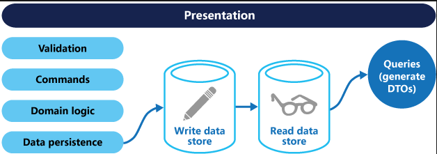

# CQRS là gì ? 
    CQRS viết tắt của từ **Command and Query Responsibility Segregation** . Nó là một mẫu thiết kết phần tách luồng đọc về luồng ghi 
## Lợi ích của CQRS 
    - Mở rộng mô hình độc lập hơn 
    - Các Model được tối ưu hóa đề phù hợp việc đọc với việc ghi 
    - Tính bảo mật sẽ cao hơn 
    - Tách các mô hình quan tâm , sử lý nó 
    - Truy vấn đơn giản hơn 
## CSRS hoạt động như thế nào ? 
    - tách ra làm 2 luồng 
    - Queries phụ trách đọc dữ liệu 
    - Command phụ trách ghi dữ liệu 
## Mô tả thông qua ảnh

# CQRS voi pattern MediatR 

DB <= | IData           | <= | Command | <= | Handler implement Irequest |
      | DATA implement  |    | Query   |    |                            |
                                | 
                                | IMediator=> send 
                                |
                              ____________  
                             | Controller |
                             |            |